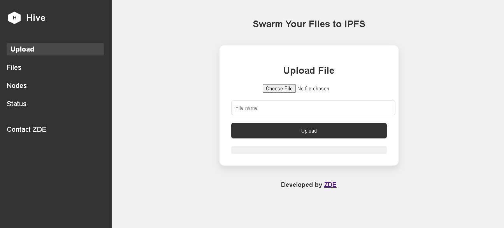

# Hive - Decentralized File Management System

Hive is a robust and user-friendly IPFS (InterPlanetary File System) file manager that provides a seamless interface for interacting with the decentralized web. This project offers a set of powerful features for managing files on IPFS, including uploading, downloading, and managing nodes.



## Features

1. File Upload: Easily upload files to IPFS.
2. File Management: View, download, and delete files stored on IPFS.
3. Node Information: Get detailed information about connected IPFS nodes.
4. Node Connectivity: Ping and manage connections to other IPFS nodes.
5. Web Interface: A clean and intuitive web interface for easy interaction.


## Getting Started

### Prerequisites

- Go 1.16 or higher
- IPFS daemon running locally or a remote IPFS node

### Installation

1. Clone the repository:
```
git clone https://github.com/zde37/Hive.git
```

2. Navigate to the project directory:
```
cd Hive
```

3. Build the project:
```
go build ./cmd/main.go
```

4. Run the application:
```
./main
```


### Configuration

The application uses environment variables for configuration. Set the following variables:

- `IPFS_RPC_ADDR`: Address of the IPFS RPC API
- `IPFS_WEB_UI_ADDR`: Address of the IPFS Web UI
- `IPFS_GATEWAY_ADDR`: Address of the IPFS Gateway
- `SERVER_ADDR`: Address for the Hive server to listen on

## Usage

After starting the application, navigate to `<SERVER_ADDR>/v1/home` e.g `http://localhost:7000/v1/home` in your web browser to access the Hive web interface.

### Uploading Files

1. Click on the "Upload" tab in the navigation menu.
2. Click to select a file from your device.
3. The file will be uploaded to IPFS, and you'll receive the IPFS hash (CID) for future reference.

### Managing Files

1. Click on the "My Files" tab to view your uploaded files.
2. Use the provided options to download, delete, or view file details.

### Node Information

1. Click on the "Nodes" tab to view information about connected IPFS nodes.
2. You can ping nodes(indirectly) and view detailed node information.

## API Endpoints

Hive provides a RESTful API for programmatic interaction:

- `GET /v1/hello-world`: Check the health status of the application
- `POST /v1/file`: Upload a file to IPFS
- `GET /v1/file?cid={CID}`: Download a file from IPFS
- `DELETE /v1/file/{CID}`: Delete a file from IPFS
- `GET /v1/pins`: List all pinned files
- `GET /v1/peers`: List all connected peers
- `GET /v1/info/{peerid}`: Get information about a specific node

## Development

### Project Structure

- `cmd/`: Contains the main application entry point
- `internal/`: Internal packages
- `config/`: Configuration management
- `handler/`: HTTP request handlers
- `ipfs/`: IPFS client implementation
- `frontend/`: Web interface files

### Running Tests

To run the test suite:
```
make test
```

## Contributing

Contributions to Hive are welcome! Please feel free to submit a Pull Request.

## License

This project is licensed under the MIT License - see the LICENSE file for details.

## Acknowledgments

- IPFS team for their amazing work on decentralized storage
- Go community for the excellent tooling and libraries

